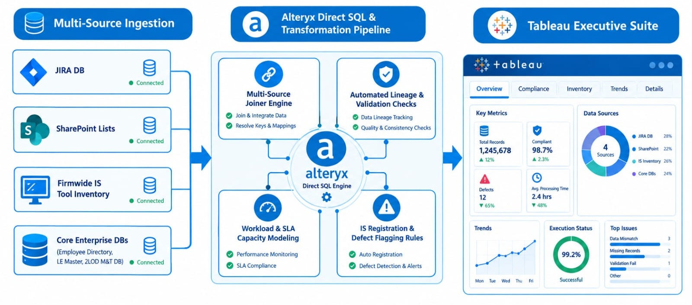
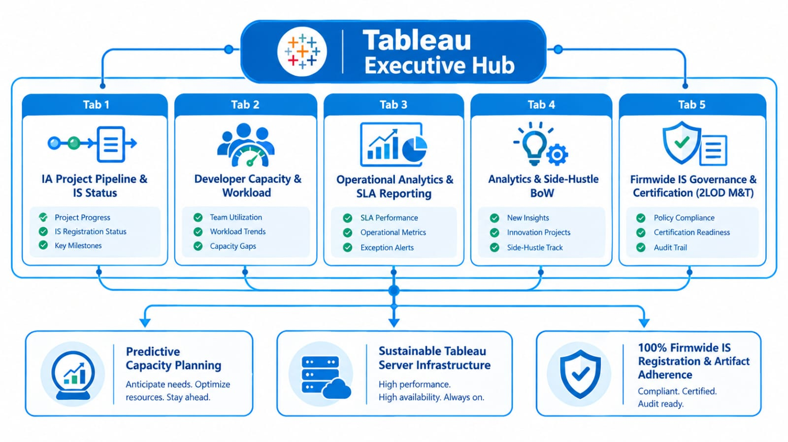

# ⚙️ Project 06: Intelligent Automation & Audit Analytics Control Ecosystem - CCOR 2LOD M&T India

## Executive Summary
* **Role:** Project Manager & Head of Data Analytics (CCOR 2LOD M&T IA Analytics Team India)
* **Impact & Delivery:** Architected and deployed an end-to-end operational control and governance ecosystem for the newly formed CCOR 2LOD M&T Intelligent Automation (IA) India team, successfully ring-fencing the entire Book of Work (BoW) across both the IA Automation and IA Analytics verticals. Additionally, spearheaded the end-to-end migration of all legacy Tableau projects onto a new, sustainable centralised server framework.
* **Leadership & Proactive Governance:** Leveraged prior large-scale enterprise application governance experience to single-handedly engineer a 5-tab Tableau Executive Control Suite powered by automated Alteryx ETL workflows. Migrated team execution from unstructured SharePoint lists to JIRA, instituted capacity planning, reverse-engineered missing documentation for inherited legacy tools, and enforced **100% Firmwide Information Security (IS) tool registration, artifact compliance, and certification**.

---

## 1. Operational Challenge & Ecosystem Architecture:

### Baseline State & Operational Gaps:
During the initial formation of the CCOR India 2LOD M&T IA team, the organisation faced severe operational friction and compliance exposure:
* **Unstructured Delivery Tracking:** Project allocations, team capacity, and execution statuses were managed across disjointed SharePoint lists and informal verbal updates, leading to constant debates among IA leads during status reviews.
* **Information Security (IS) Governance Deficits:** Multiple automation scripts and analytics tools—including legacy dashboards transitioned from US teams—lacked formal registration on the Firmwide IS Tool Inventory, missing mandatory System Design Documents (SDDs), Business Requirement Documents (BRDs), and IS certification.
* **Invisible Analytics:** Ad-hoc data requests, custom Alteryx scripts, and recurring reporting deliverables produced by the analytics team lacked central leadership visibility, preventing accurate resource modelling.
* **Unsustainable Reporting Infrastructure:** Legacy Tableau projects were operating on an outdated framework, causing performance and maintainability issues across the analytics portfolio.

### The Ecosystem Solution & Architecture:
To resolve these challenges, a multi-source automated governance ecosystem was engineered using **Alteryx Designer** for complex data integration and **Tableau Server** for multi-perspective executive reporting.

```text
┌────────────────────────────────────────────────────────────────────────────────────────┐
│                        DATA INGESTION & SOURCE SYSTEMS                                 │
│  ┌─────────────┐   ┌─────────────────┐   ┌────────────────┐   ┌─────────────────────┐  │
│  │ JIRA API    │   │ SharePoint      │   │ Firmwide IS    │   │ Core Enterprise DBs │  │
│  │ (IA & Analytics │ (Operational    │   │ Tool Inventory │   │ (Employee Roster,   │  │
│  │ Projects)   │   │ Reporting BoW)  │   │ Data Dumps)    │   │ LE Master, 2LOD DB) │  │
│  └──────┬──────┘   └────────┬────────┘   └───────┬────────┘   └──────────┬──────────┘  │
└─────────┼───────────────────┼────────────────────┼───────────────────────┼─────────────┘
          │                   │                    │                       │
          └───────────────────┴────────────┬───────┴───────────────────────┘
                                           ▼
┌────────────────────────────────────────────────────────────────────────────────────────┐
│                      ALTERYX DIRECT SQL & ETL PIPELINE                                 │
│  ┌──────────────────────────────────────────────────────────────────────────────────┐  │
│  │ • Multi-Source Data Joiner & Entity Mapping Engine                               │  │
│  │ • Automated Lineage & Upstream Data Validation Checks                            │  │
│  │ • Developer Workload & SLA Capacity Modelling                                    │  │
│  │ • Firmwide IS Registration Eligibility & Defect Flagging Rules                   │  │
│  └────────────────────────────────────────┬─────────────────────────────────────────┘  │
└───────────────────────────────────────────┼────────────────────────────────────────────┘
                                            ▼
┌────────────────────────────────────────────────────────────────────────────────────────┐
│                   TABLEAU EXECUTIVE CONTROL SUITE (5-TAB HUB)                          │
│  ┌──────────────┬──────────────┬──────────────┬──────────────────┬──────────────────┐  │
│  │    TAB 1     │    TAB 2     │    TAB 3     │      TAB 4       │      TAB 5       │  │
│  │  IA Project  │ Developer    │ Operational  │ Analytics & BoW  │ Firmwide IS      │  │
│  │  Pipeline &  │ Capacity &   │ Analytics    │                  │ Governance &     │  │
│  │  IS Status   │ Workload     │ Reporting    │                  │ Cert. 2LOD M&T   │  │
│  └──────────────┴──────────────┴──────────────┴──────────────────┴──────────────────┘  │
└────────────────────────────────────────────────────────────────────────────────────────┘
```



---

## 2. Technical Stack & Data Source Integration:

### Core Tooling:
* **ETL & Data Transformation:** Alteryx Designer (Direct SQL, Multi-Source Joins, Rule Engines)
* **Visualisation & Executive Reporting:** Tableau Server/ Desktop (Interactive 5-Tab Suite)
* **Project Tracking & Agile SDLC:** JIRA (Database Extracts)
* **Operational Repositories:** SharePoint Online Lists (Reporting Book of Work)

### Data Sources & Field Mapping Integrations:
1. **JIRA Project Database:** Extracts real-time sprint progress, task allocations, target completion dates, and developer commentary for all IA automation projects, analytical projects, and day-to-day analytical reporting BoW.
2. **SharePoint Online Operational Lists:** Ingests the recurring reporting Book of Work (BoW), tracking SLA delivery status, publication states, and repository storage links.
3. **Firmwide IS Tool Inventory Data Dumps:** Ingests enterprise tool registrations, mapping primary/ secondary application owners, developer alignments, IS champions, and certification lifecycle states.
4. **Enterprise Employee Directory DB:** Maps employee IDs, reporting hierarchies, team structures, and location metadata across 2LOD M&T verticals.
5. **Dynamic Legal Entity (LE) Master DB:** Maps project deliverables to specific legal entities, business units, and regulatory jurisdictions.

---

## 3. Deep Dive: The 5-Tab Tableau Executive Control Suite:



### Tab 1: IA Project Pipeline & IS Eligibility Control:
* **Data Mechanics:** Alteryx merges JIRA project data with the Employee DB and LE Master DB.
* **Analytical & Data Methods:** Applied string standardised algorithms to unify disparate project titles across systems, coupled with conditional logic rules that flag projects exceeding risk thresholds for mandatory IS evaluation.
* **Functional Scope:** Tracks end-to-end automation projects across lifecycle stages: *Pipeline*, *Unassigned*, *WIP*, *On-Hold*, *Completed*, *Registered*, and *Audit Savings Generated*.
* **Governance Intelligence:** Automatically evaluates whether an active automation project meets the threshold for mandatory Firmwide IS registration. Flags projects that are eligible but unregistered, prompting immediate action before production release.

### Tab 2: IA Developer Capacity & Book of Work Allocation:
* **Data Mechanics:** Angles the unified JIRA dataset to calculate developer-level effort and project density.
* **Analytical & Data Methods:** Built a predictive workload density model using historical velocity metrics and active story-point distribution to generate early-warning indicators for developer burn-out or impending sprint bottlenecks.
* **Functional Scope:** Provides M&T IA India Team Leads and the Head of M&T IA India, with transparent capacity management.
* **Strategic Utility:** Visualises developer bandwidth, enabling data-backed staffing requests, resource rebalancing during sprint surges, and elimination of delivery bottlenecks.

### Tab 3: Operational Analytics & Daily Reporting BoW:
* **Data Mechanics:** Automated daily extract from SharePoint Online operational lists.
* **Analytical & Data Methods:** Implemented automated timestamp-delta calculations against baseline SLAs, using statistical run-charts to detect subtle trend slips before an actual SLA breach occurs.
* **Functional Scope:** Monitors regular, recurring reporting operations—tracking SLA compliance (*Met SLA: Yes/No*), publication state (*Published: Yes/No*), individual report owners, and direct repository links.
* **Value Add:** Eliminates missed SLA queries by allowing stakeholders to self-serve and retrieve report links directly from the dashboard.

### Tab 4: Advanced Analytics & "Side-Hustle" Pipeline:
* **Data Mechanics:** Direct JIRA API integration tracking non-standard, innovative analytics deliverables built using Alteryx and Tableau.
* **Analytical & Data Methods:** Utilised text analytics and regular expression (Regex) parsing on JIRA commentary fields to automatically extract risk flags, blocking dependencies, and target delivery variance.
* **Functional Scope:** Grants executive leadership total line-of-sight into ad-hoc analytics projects, innovation sprints, and side-hustle dashboards.
* **Value Add:** Ensures that extra-curricular technical contributions are formally recognised, resource-allocated, and delivered against clear SLAs.

### Tab 5: Firmwide IS Governance & Certification Control:
* **Data Mechanics:** Direct mapping of Firmwide IS Tool dumps against the 2LOD Employee DB and IA Project BoW.
* **Analytical & Data Methods:** Executed fuzzy-matching joins (Jaro-Winkler distance) to reconcile orphaned tool names across legacy US repositories against active employee profiles to identify unassigned primary owners.
* **Functional Scope:** Displays 100% ownership mapping across 2LOD M&T tools (Primary Owner, Secondary Owner, Primary Developer, Backup Developer, IS Champion, Backup Champion).
* **Audit Remediation:** Automatically flags uncertified or unregistered tools—including legacy dashboards transitioned from US teams—triggering mandatory reverse-engineering of SDDs, BRDs, and artifact storage.

---

## 4. Proactive Leadership & Governance Mastery:

### Reverse-Engineering Documentation & IS Adherence:
* **Legacy Tool Standardisation:** Inherited multiple uncertified tools during the US-to-India transition without technical documentation.
* **Artifact Remediation:** Personally led the reverse-engineering of comprehensive System Design Documents (SDDs), Business Requirement Documents (BRDs), and data dictionary field mappings.
* **100% IS Certification:** Drove SME support across 2LOD M&T, achieving 100% adherence to Firmwide Information Security standards and eliminating audit compliance red flags.

### Enterprise Tableau Infrastructure Migration:
* **Sustainable Server Framework:** Led the end-to-end migration of all legacy Tableau dashboard projects from an outdated, fragmented framework to a new, highly sustainable, centralised Tableau Server infrastructure, ensuring long-term scalability and automated refresh capabilities.

---

## 5. Measurable Business Results & Impact"

| Performance Metric | 🛑 Baseline State (Pre-Ecosystem) | 🎯 Post-Deployment State (Project 06) | 💡 Strategic Value |
| --- | --- | --- | --- |
| **Tracking Framework** | Fragmented SharePoint lists & verbal reviews | **Centralised JIRA & Tableau 5-Tab Suite** | Objective capacity planning and transparent BoW |
| **Tableau Infrastructure** | Outdated, fragmented dashboard framework | **Centralised, Sustainable Server Framework** | Long-term scalability & automated delivery |
| **Firmwide IS Compliance** | Unregistered scripts & uncertified US tools | **100% IS Registered & Certified Portfolio** | Zero regulatory compliance or security exposure |
| **Documentation Rate** | Missing BRDs/SDDs for inherited tools | **100% Reverse-Engineered Artifact Compliance** | Full audit trail and institutional continuity |
| **Reporting SLA Tracking** | Informal updates via email/chat | **Automated SLA Tracking & Direct Link Repository** | Instant executive visibility and self-service |

---

## Key Takeaways & Leadership Impact:

* **Proactive Ownership:** Recognised operational and governance gaps upon joining the team and independently designed a scalable ecosystem without waiting for external mandates.
* **Enterprise Scaling:** Applied prior experience managing 800+ applications from WPO to establish robust, audit-ready governance across a newly formed 2LOD M&T India team.
* **T-Shaped Execution:** Combined high-level strategic alignment (stakeholder management, IS compliance, capacity planning) with deep technical execution (Alteryx ETL, JIRA integration, Tableau architecture).


